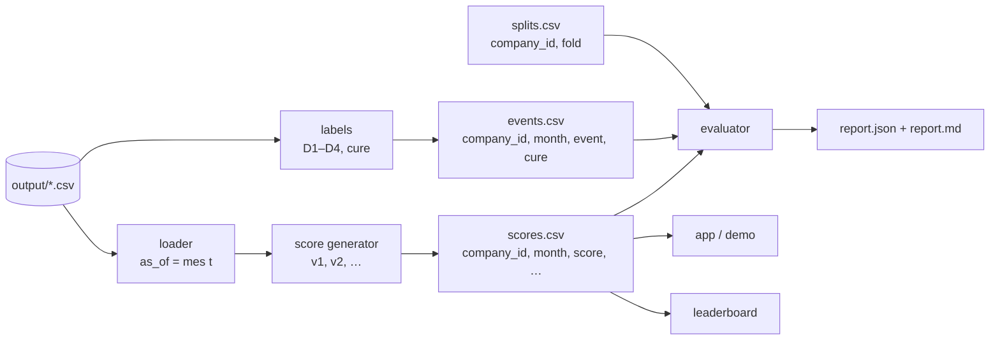

# Arquitectura: generador de score y evaluador

Dos módulos independientes que solo se hablan por ficheros con esquema fijo. El generador **nunca ve los eventos**; el evaluador **nunca ve los datos crudos**. Así el evaluador es el mismo para cualquier versión del score (scorecard, modelo, ELO, lo que sea) y no se puede hacer trampa sin querer.



## Módulos

| Módulo | Entrada | Salida | Quién lo toca |
|---|---|---|---|
| **loader** | `output/*.csv`, `as_of` (fin de mes) | dataframes con solo filas de fecha ≤ `as_of`; estado de facturas derivado a esa fecha | se escribe una vez y no se toca |
| **labels** | `output/*.csv` completos | `events.csv` | se acuerda una vez (umbrales D1–D4) y se congela |
| **splits** | `companies.csv` | `splits.csv` | se genera una vez con semilla fija |
| **score generator** | loader(`as_of`) para cada mes | `scores.csv` | aquí se itera: v1, v2, v3… |
| **evaluator** | `scores.csv`, `events.csv`, `splits.csv` | `report.json`, `report.md` | se escribe una vez; solo se añaden métricas |

La regla de oro: **si cambias el generador, el evaluador no cambia; si cambias el evaluador, todos los generadores se re-evalúan.** Ninguno importa código del otro.

## Contratos de ficheros

### `scores.csv` — salida del generador, entrada del evaluador

Una fila por empresa y mes de observación.

| columna | tipo | obligatoria | descripción |
|---|---|---|---|
| `company_id` | str | sí | `COMP_xxxx` |
| `month` | `YYYY-MM` | sí | mes de observación *t*. El score usa **solo datos ≤ fin de *t*** |
| `score` | float 0–100 | sí | mayor = más sana |
| `score_version` | str | sí | `v1-scorecard`, `v2-gbm`… |
| `c_<dimension>` | float | no | contribución de cada dimensión al score (explicación). Ej. `c_liquidez`, `c_pago`, `c_cobro`, `c_deuda`, `c_concentracion` |
| `alert` | 0/1 | no | el monitor levanta la mano este mes |
| `explanation` | str | no | frase corta: "bajó 8 pts: % facturas vencidas 10 % → 30 %" |

Reglas:
- Cubrir **todas** las empresas y todos los meses desde el 6º (mes con ≥ 6 de historia). Faltantes = error del generador.
- Sin NaN en `score`. Si no hay datos suficientes, el generador decide un valor y lo marca en `explanation`.
- El generador se ejecuta como `generate(as_of) → filas de ese mes`, en bucle sobre los meses. Así es físicamente imposible usar datos futuros: el loader no se los da.

### `events.csv` — salida de labels, entrada del evaluador

Una fila por empresa y mes.

| columna | tipo | descripción |
|---|---|---|
| `company_id` | str | |
| `month` | `YYYY-MM` | |
| `D1` … `D4` | 0/1 | cada regla de [validacion_salud.md §1](validacion_salud.md) |
| `event` | 0/1 | `max(D1..D4)` |
| `cure` | 0/1 | estuvo en evento ≥ 2 meses y lleva ≥ 3 sin ninguno |

Se calcula con los datos completos (aquí sí se puede mirar el futuro: es la verdad contra la que se evalúa). Una vez acordados los umbrales, el fichero se versiona (`events_v1.csv`) y no se toca; si se cambia, se re-evalúa todo.

### `splits.csv`

| columna | descripción |
|---|---|
| `company_id` | |
| `fold` | 0–4, asignado **por `group_id`** (todas las filiales de un grupo en el mismo fold) con semilla fija |

### `report.json` — salida del evaluador

```json
{
  "score_version": "v1-scorecard",
  "events_version": "events_v1",
  "n_pairs": 16718,
  "event_rate": 0.11,
  "gini": {"h1": 0.71, "h3": 0.62, "h6": 0.55},
  "ks": {"h6": 0.41},
  "gini_cure_h6": 0.38,
  "lead_time_months": {"median": 2.0, "p25": 1.0, "p75": 4.0},
  "oos": {"gini_h6_by_fold": [0.53, 0.56, 0.51, 0.58, 0.54], "mean": 0.544, "drop_vs_in_sample": 0.006},
  "oot": {"train_months": "…2025-08", "test_months": "2025-09…", "gini_h6": 0.52},
  "psi": {"2025-03_vs_2026-03": 0.06},
  "autocorr_lag1": 0.89,
  "univariate": {"c_pago": 0.48, "c_liquidez": 0.35, "c_deuda": 0.22, "c_cobro": 0.31, "c_concentracion": 0.09},
  "worst_false_negatives": ["COMP_0412", "COMP_0877", "…"],
  "worst_false_positives": ["COMP_0033", "…"]
}
```

`report.md` es el mismo contenido en tablas, para pegarlo en la KB o enseñarlo al jurado. El evaluador también deja un `comparison.md` con una fila por `score_version` evaluada, para ver de un vistazo si v2 mejora a v1.

## Qué calcula el evaluador (y solo eso)

Con `scores`, `events` y `splits`, sin ningún otro dato:

1. Une por (`company_id`, `month`). Para cada fila y horizonte h ∈ {1, 3, 6}: `y_h = 1` si `event = 1` en algún mes de *t+1 … t+h*.
2. **Gini y KS** por horizonte (score invertido: menor score ⇒ más probable el evento).
3. **Gini de mejora**: sobre filas con `event = 1` en *t*, Δscore(*t*, *t−3*) contra `cure` en *t+1…t+6*.
4. **Lead time**: por empresa con primer evento en *m*, primer mes en que `score` < umbral (percentil 20 del mes); mediana de *m* − ese mes.
5. **OOS**: Gini por fold — solo tiene sentido si el generador fue entrenado sin ese fold; el evaluador recibe `scores_fold{k}.csv` o una columna `trained_without_fold`. Para un scorecard sin entrenamiento, OOS = Gini por fold sin más.
6. **OOT**: Gini en los últimos 6 meses de observación vs. el resto.
7. **PSI** entre dos meses separados 12 meses; **autocorrelación** lag 1.
8. **Univariante**: Gini de cada columna `c_*` por separado. Si `gini.h6` del score < max(univariante), lo marca en rojo.
9. **Casos**: 10 peores falsos negativos (score alto, evento en ≤ 3 meses) y 10 peores falsos positivos.

Lo que el evaluador **no** hace: calcular features, leer `transactions.csv`, decidir umbrales de eventos. Si necesita algo que no está en los tres CSV, se añade al contrato, no se le da acceso a los datos.

## Ubicación en el repo

```
Elkano_Embat/
  apps/web/            # Next.js + Convex (demo)
  analytics/           # Python; no depende de apps/
    loader.py          # load(as_of) → dict de dataframes truncados
    labels.py          # build_events() → data/events_v1.csv
    splits.py          # build_splits() → data/splits.csv
    scorers/
      base.py          # interfaz: generate(loaded, as_of) → DataFrame[scores]
      v1_scorecard.py
      v2_model.py
    evaluate.py        # evaluate(scores, events, splits) → report.json/.md
    run.py             # CLI: run.py score --version v1 | run.py eval --scores …
    data/              # salidas versionadas (scores_v1.csv, events_v1.csv, report_v1.json)
  output/              # CSV crudos (ignorado por git)
```

Comandos:

```bash
python analytics/run.py labels                      # → data/events_v1.csv (una vez)
python analytics/run.py splits                      # → data/splits.csv   (una vez)
python analytics/run.py score --version v1          # → data/scores_v1.csv
python analytics/run.py eval  --scores data/scores_v1.csv   # → data/report_v1.{json,md}
```

La app lee `scores_vN.csv` (o su equivalente en Convex) y nada más: score, contribuciones, alerta y explicación por empresa y mes. El leaderboard recibe el mismo `scores.csv` filtrado a las empresas del test oculto y al formato que pidan.

## Orden de construcción

1. `loader` + `labels` + `splits` (medio día, no se vuelven a tocar).
2. `evaluate.py` contra un score trivial (p. ej. score = percentil del saldo medio) para comprobar que todo el pipeline funciona y tener el Gini de referencia que hay que superar.
3. `v1_scorecard` → evaluar → iterar. Cada versión deja su `report_vN.json`; `comparison.md` dice cuál va ganando.
