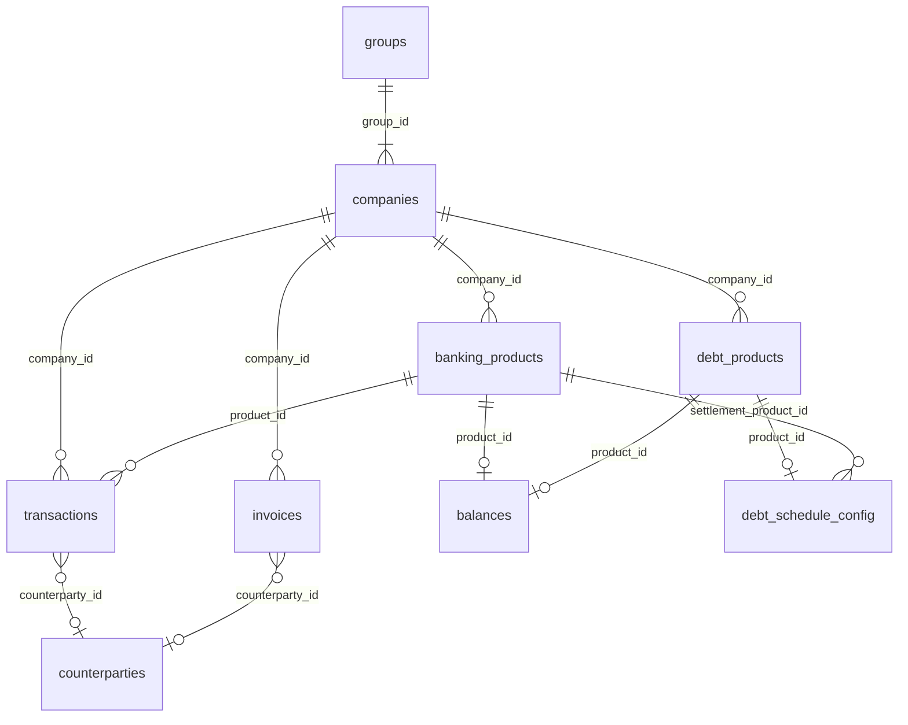

# Mapa de datos — output_hackspain_data.zip

Medido leyendo los 8 CSV completos (646 MB, 3.472.176 filas). Versión visual: [data-map.html](data-map.html). Diccionario oficial: `output/data_dictionary.md`.

## Cifras clave

| | |
|---|---|
| Ficheros | 8 CSV · 646 MB |
| Filas totales | 3.472.176 |
| Grupos → empresas | 250 → 1.286 |
| Productos | 8.226 (5.987 bancarios + 2.239 deuda) |
| Contrapartes distintas | 129.701 (47.796 en transactions · 124.030 en invoices · 42.125 en ambas) |
| Periodo | 2024-09-01 → 2026-09-01 (24 meses) |

## Relaciones

| Clave foránea | Referencia | Ids que resuelven | Nota |
|---|---|---|---|
| `companies.group_id` | groups | 100 % | |
| `*.company_id` (7 tablas) | companies | 100 % | transactions cubre 1.286 empresas; invoices 785; debt_products 378; debt_schedule_config 40 |
| `balances.product_id` | banking_products ∪ debt_products | 99,6 % | 1 fila por producto; `product_id` es un espacio único para ambos ficheros |
| `transactions.product_id` | banking_products ∪ debt_products | 99,5 % | 5.311 productos con movimientos |
| `debt_schedule_config.product_id` | debt_products | 100 % | 87 de 2.239 productos de deuda |
| `debt_schedule_config.settlement_product_id` | banking_products | 91 % | cuenta de liquidación; 9 % huérfanas |
| `transactions.counterparty_id` | *(sin tabla maestra)* | 9,8 % informado | 47.796 ids distintos |
| `invoices.counterparty_id` | *(sin tabla maestra)* | 98,7 % informado | 124.030 ids; 42.125 comunes con transactions → cruce factura ↔ movimiento |

## Volumen

| Fichero | Filas | Tamaño |
|---|---:|---:|
| transactions.csv | 2.556.437 | 472 MB |
| invoices.csv | 897.894 | 173 MB |
| balances.csv | 7.996 | 481 KB |
| banking_products.csv | 5.987 | 596 KB |
| debt_products.csv | 2.239 | 268 KB |
| companies.csv | 1.286 | 71 KB |
| groups.csv | 250 | 5 KB |
| debt_schedule_config.csv | 87 | 13 KB |

## Columnas y tipos

Tipo inferido leyendo cada valor. *Vacío* = % de celdas en blanco.

### groups.csv — 250 filas · 3 columnas

Un grupo empresarial (holding) por fila; 1–22 empresas en muestra.

| Columna | Tipo | Vacío | Detalle |
|---|---|---:|---|
| `group_id` | clave | 0,0 % | 250 distintos |
| `erp` | texto | 64,4 % | `Microsoft Business Central` 28 · `Netsuite` 19 · `SAP Business One` 6 · `Microsoft Navision` 6 · `Sage 200` 5 · `Sage X3` 4 · +15 más |
| `n_companies_in_sample` | número | 0,0 % | 1,00 → 22,00 |

### companies.csv — 1.286 filas · 6 columnas

Clave central: toda tabla hija lleva `company_id`.

| Columna | Tipo | Vacío | Detalle |
|---|---|---:|---|
| `company_id` | clave | 0,0 % | 1.286 distintos |
| `group_id` | clave | 0,0 % | 250 distintos |
| `country` | texto | 82,1 % | `ES` 142 · `ESPAÑA` 14 · `NL` 14 · `DE` 11 · `España` 9 · `FR` 6 · +16 más |
| `currency` | texto | 0,0 % | `EUR` 1.149 · `GBP` 42 · `USD` 36 · `MXN` 7 · `DKK` 6 · `AUD` 5 · +22 más |
| `erp` | texto | 42,1 % | `businessCentral` 322 · `netsuite` 143 · `businessOne` 47 · `sage200` 47 · `dynamicsAx` 42 · `sageX3` 30 · +14 más |
| `created_at` | fecha | 0,0 % | 2021-11-17 → 2026-07-16 |

### banking_products.csv — 5.987 filas · 8 columnas

Cuentas corrientes, tarjetas, inversión, TPV… 1 fila por producto.

| Columna | Tipo | Vacío | Detalle |
|---|---|---:|---|
| `product_id` | clave | 0,0 % | 5.987 distintos |
| `company_id` | clave | 0,0 % | 1.283 distintos |
| `label` | texto | 0,0 % | 143 distintos |
| `type` | texto | 0,0 % | `checking` 4.854 · `card` 796 · `investment` 201 · `wallet` 34 · `tpv` 25 · `risk` 25 · +3 más |
| `bank_name` | texto | 0,0 % |  |
| `service` | texto | 0,0 % | 198 distintos |
| `currency` | texto | 0,0 % | `EUR` 4.919 · `USD` 582 · `GBP` 197 · `MXN` 25 · `CAD` 21 · `NOK` 21 · +33 más |
| `created_at` | fecha | 0,0 % | 2021-11-18 → 2026-09-15 |

### debt_products.csv — 2.239 filas · 11 columnas

Préstamos, líneas, confirming, leasing… con importe concedido y pendiente.

| Columna | Tipo | Vacío | Detalle |
|---|---|---:|---|
| `product_id` | clave | 0,0 % | 2.239 distintos |
| `company_id` | clave | 0,0 % | 378 distintos |
| `label` | texto | 0,0 % |  |
| `type` | texto | 0,0 % | `loan` 1.022 · `lineofcredit` 536 · `confirming` 229 · `leasing` 179 · `guarantee` 155 · `mortgage` 60 · +2 más |
| `bank_name` | texto | 0,0 % | 64 distintos |
| `service` | texto | 0,0 % | 60 distintos |
| `currency` | texto | 0,0 % | `EUR` 2.221 · `USD` 15 · `GBP` 2 · `MXN` 1 |
| `created_at` | fecha | 0,0 % | 2022-04-06 → 2026-09-15 |
| `granted` | número | 7,5 % | -300,0 M → 2,0 M |
| `outstanding` | número | 0,0 % | -300,0 M → 21,4 M |
| `liquidity` | número | 64,1 % | 0,00 → 42,7 M |

### debt_schedule_config.csv — 87 filas · 14 columnas

Términos del préstamo (amortización, tipo, periodos) para 87 productos de deuda.

| Columna | Tipo | Vacío | Detalle |
|---|---|---:|---|
| `product_id` | clave | 0,0 % | 87 distintos |
| `company_id` | clave | 0,0 % | 40 distintos |
| `settlement_product_id` | clave | 0,0 % | 68 distintos |
| `currency` | texto | 0,0 % | `EUR` 87 |
| `amortization_type` | texto | 0,0 % | `constant quote` 87 |
| `interest_calc_method` | texto | 0,0 % | `30/360` 81 · `Actual/Actual ISDA` 6 |
| `amortising_frequency` | texto | 0,0 % | `monthly` 79 · `quarterly` 5 · `semiannually` 3 |
| `granted_balance` | número | 0,0 % | 0,00 → 300,0 M |
| `outstanding_balance` | número | 0,0 % | 2,43 → 300,0 M |
| `total_periods` | número | 0,0 % | 1,00 → 180,00 |
| `next_payment_date` | fecha | 0,0 % | 2024-03-19 → 2027-01-22 |
| `last_payment_date` | fecha | 0,0 % | 2024-02-27 → 2026-09-15 |
| `annual_interest_rate_or_spread` | número | 0,0 % | 0,00 → 0,11 |
| `interest_type` | texto | 0,0 % | `fixed` 58 · `variable` 29 |

### balances.csv — 7.996 filas · 8 columnas

Saldo por producto a 2026-09-01 (o el snapshot anterior más cercano).

| Columna | Tipo | Vacío | Detalle |
|---|---|---:|---|
| `product_id` | clave | 0,0 % | 7.996 distintos |
| `company_id` | clave | 0,0 % | 1.273 distintos |
| `date` | fecha | 0,0 % | 2026-08-25 → 2026-09-01 |
| `balance` | número | 0,0 % | -1.000,0 M → 100.000,0 M |
| `available` | texto | 100,0 % |  |
| `granted` | número | 66,9 % | -300,0 M → 2,0 M |
| `liquidity` | número | 76,3 % | -23.638,71 → 1.000,2 M |
| `countable` | número | 91,7 % | -23,4 M → 1.001.000,2 M |

### transactions.csv — 2.556.437 filas · 12 columnas

Movimientos bancarios 2024-09 → 2026-09. Texto anonimizado con placeholders.

| Columna | Tipo | Vacío | Detalle |
|---|---|---:|---|
| `transaction_id` | clave | 0,0 % |  |
| `company_id` | clave | 0,0 % | 1.286 distintos |
| `product_id` | clave | 0,0 % | 5.311 distintos |
| `date` | fecha | 0,0 % | 2024-09-01 → 2026-09-01 |
| `value_date` | fecha | 0,0 % | 2022-07-01 → 2099-12-31 |
| `amount` | número | 0,0 % | -3.069,8 M → 3.100,0 M |
| `exchange_rate` | número | 0,0 % | 0,00 → 6.500,00 |
| `status` | texto | 1,2 % | `booked` 2.520.019 · `pending` 6.579 |
| `accounting_status` | texto | 61,6 % | `RECONCILIATION_COMPLETED` 528.034 · `DISCARDED` 308.568 · `PENDING` 95.281 · `ACCOUNTING_COMPLETED` 30.995 · `ACCOUNTING_RECOMMENDATION` 18.064 · `RECONCILIATION_RECOMMENDATION` 1.626 |
| `category` | texto | 0,0 % | `-` 635.530 · `collection` 567.417 · `payment` 362.276 · `utility` 259.430 · `fee` 179.500 · `transfer` 152.102 · +17 más |
| `description` | texto | 0,0 % |  |
| `counterparty_id` | clave | 90,2 % | 47.796 distintos |

### invoices.csv — 897.894 filas · 14 columnas

Facturas sincronizadas del ERP con ciclo emisión → vencimiento → pago.

| Columna | Tipo | Vacío | Detalle |
|---|---|---:|---|
| `operation_id` | clave | 0,0 % |  |
| `company_id` | clave | 0,0 % | 785 distintos |
| `document_type` | texto | 0,0 % | `invoice` 760.406 · `paymentDocument` 53.761 · `note` 38.154 · `deposit` 21.390 · `invoiceGroup` 13.775 · `deliveryNote` 6.380 · +4 más |
| `issuance_date` | fecha | 0,0 % | 2024-09-01 → 2026-09-01 |
| `due_date` | fecha | 0,0 % | 2000-03-01 → 7025-07-31 |
| `payment_date` | fecha | 0,0 % | 2000-10-31 → 6913-11-20 |
| `amount` | número | 0,0 % | -62.442,2 M → 62.442,2 M |
| `pending_amount` | número | 0,0 % | -1.613,5 M → 1.272,1 M |
| `currency` | texto | 0,0 % | `EUR` 767.795 · `USD` 55.608 · `GBP` 21.048 · `CLP` 8.247 · `CAD` 6.593 · `MXN` 6.527 · +33 más |
| `accounting_currency` | texto | 0,0 % | `EUR` 779.839 · `USD` 35.020 · `GBP` 24.770 · `CLP` 8.368 · `MXN` 6.912 · `COP` 6.266 · +17 más |
| `exchange_rate` | número | 0,0 % | 0,00 → 20.303,01 |
| `status` | texto | 0,0 % | `paid` 660.299 · `overdue` 192.556 · `pending` 29.717 · `cancel` 13.699 · `payment_in_progress` 1.216 · `paymentOrder` 406 · +1 más |
| `concept` | texto | 0,4 % |  |
| `counterparty_id` | clave | 1,3 % | 124.030 distintos |

## Avisos de calidad

- **`transactions.csv` contiene bytes NUL.** El lector `csv` de Python lanza `line contains NUL`; filtrar `\0` al leer.
- **`companies.country`** vacío en el 82 % y mezcla `ES`, `ESPAÑA`, `España`, `Portugal`… Normalizar a ISO-2.
- **`transactions.counterparty_id`** vacío en el 90 %; `category` vale `-` en 635.530 filas (25 %); `accounting_status` vacío en el 62 %.
- **`balances.available`** vacío al 100 %; `countable` al 92 % y `liquidity` al 76 %. Solo `balance` es fiable.
- **Fechas fuera de rango.** `transactions.value_date` llega a 2099-12-31 (y empieza en 2022); `invoices.due_date` hasta el año 7025 y `payment_date` hasta 6913 (desde 2000).
- **Importes extremos.** `invoices.amount` ±62.442 M; `balances.balance` de −1e9 a 9,99e10; `transactions.amount` ±3.100 M. Filtrar outliers antes de agregar.
- **Signo de la deuda.** En `debt_products`, `granted` y `outstanding` son negativos (hasta −300 M); en `debt_schedule_config` los mismos importes son positivos.
- **Referencias huérfanas.** 9 % de `settlement_product_id` no está en banking_products; ~0,5 % de `product_id` en balances y transactions no existe en ningún fichero de productos.
- **Cobertura desigual.** Todas las empresas tienen transacciones, pero solo 785 tienen facturas y 378 tienen deuda; debt_schedule_config cubre 87 de 2.239 productos de deuda.
- **`exchange_rate = 0`** aparece en transactions e invoices; en invoices llega a 20.303. No dividir por él sin comprobar.
- **Placeholders** en `description`/`concept`: `COUNTERPARTY_xxxxx`, `[COMPANY]`, `[PERSON]`, `[IBAN]`, `[REF]`, `[NUM]`, `[X]`… (ver diccionario).
